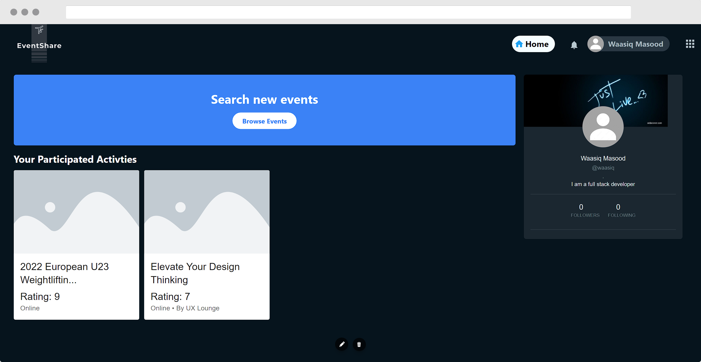

## EventShare


# 📖 Table of Contents
- 📖 Table of Contents
- 📝 About
- 💻 Working
- ⚙️ Tech Stack
- 🔍 Features
- 🔨 Installation
- 📜 License
- 🔮 Future Plans

# 📝 About
EventShare is a web-based platform that allows users to discover and participate in various events from different websites. It aims to provide a centralized hub for event enthusiasts to find and explore a wide range of activities, including concerts, workshops, conferences, and more. Users can easily browse through different categories, view event details, and participate in events of their interest.

# 💻 Working
A demo video showcasing the features and functionality of EventShare can be found here.

# ⚙️ Tech Stack
EventShare is built using the following technologies:

1. Frontend:
- React
- TypeScript
- Material UI
- Tailwind CSS
2. Backend:
- Node.js
- Express
- MongoDB
3. Authentication:
- Token-based Authentication
4. Web Scraping:
- Puppeteer

# 🔍 Features
EventShare offers the following features:

## Event Discovery: 
Users can easily search for events based on location, date, category, and keywords to find the events that match their interests.
## Event Details: 
Each event listing provides comprehensive information, including event description, date, time, location, organizer details, and participant requirements.
## Participate in Events: 
Users can directly participate in events by registering through EventShare. The platform facilitates the registration process and provides necessary details to users.
User Profiles: Users can create personalized profiles, track their event participation history, and manage their preferences.
## Event Recommendations: 
EventShare utilizes recommendation algorithms to suggest relevant events based on a user's previous participation and preferences.
User Reviews and Ratings: Users can share their experiences and provide ratings for events they have attended, helping others make informed decisions.
## Event Sharing:
Users can share interesting events with their friends and networks through social media integration.

# 🔨 Installation
Follow these steps to set up and run EventShare locally:

- Clone the repository
```bash
Copy code
git clone 
```
Install dependencies for the frontend
```bash
cd frontend
npm install
```

Install dependencies for the backend
```bash
cd backend
npm install
```

Set up the database
```bash
Install MongoDB and start the MongoDB server.
Create a new MongoDB database for EventShare.
Update the database connection URL in the backend configuration files (config.js or .env file).
```

In the frontend directory, run:
```bash
npm start
```
In the backend directory, run:
```bash
npm start
```

Access EventShare in your browser at http://localhost:3000.

## 📜 License
License: MIT

## 🔮 Future Plans
- User Preferences: Implement personalized event recommendations based on user preferences and interests.
- Event Tracking: Allow users to track and manage their registered and attended events.
- Social Integration: Enable users to connect and share events with their social media accounts.
- Event Notifications: Implement a notification system to keep users updated about upcoming events.
- Event Ratings and Reviews: Allow users to provide ratings and reviews for events they have attended.
- Event Categories: Introduce a categorization system to organize events based on genres, themes, or types.
- Event Bookmarking: Enable users to bookmark events for future reference or to revisit later.
- Event Recommendations: Improve the event recommendation algorithms to provide more accurate and relevant suggestions.
- Mobile Application: Develop a mobile application for EventShare to extend its reach to mobile users.
- Performance Optimization: Optimize the platform for better performance and scalability.
- Internationalization: Add support for multiple languages to cater to a wider user base.
- Event Organizer Dashboard: Create a dedicated dashboard for event organizers to manage and promote their events.